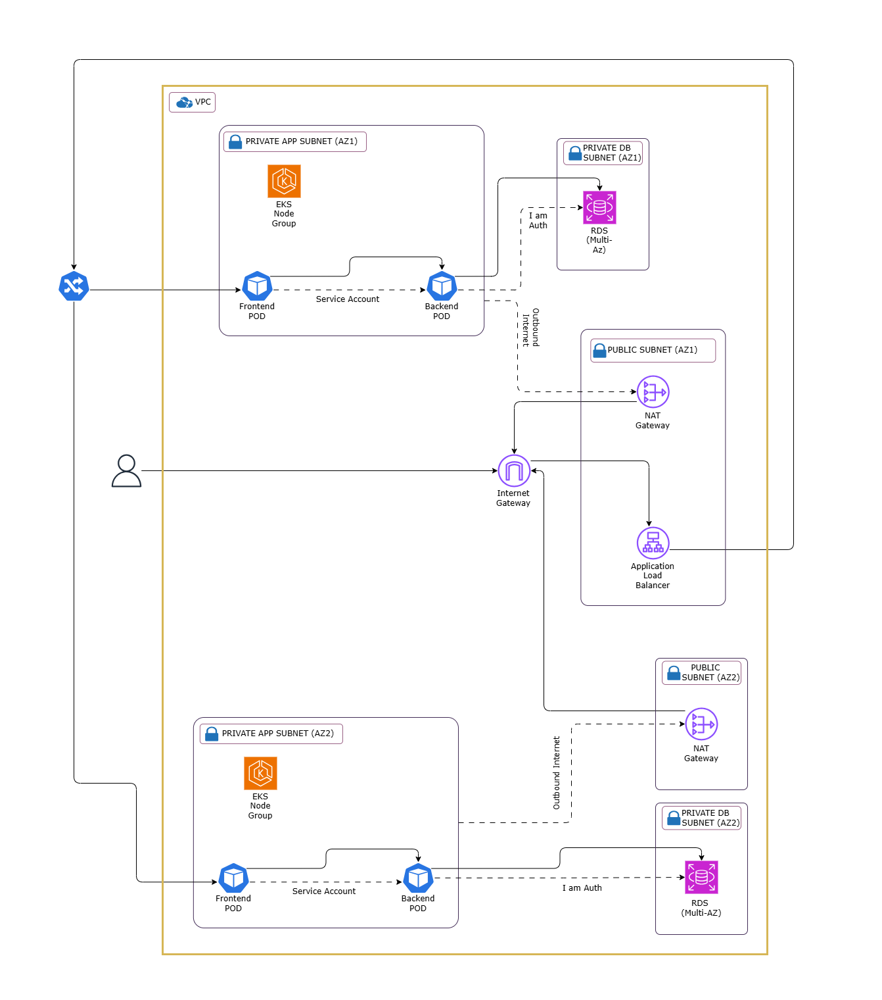

# AWS EKS 3-Tier Kubernetes Stack

This project provides an end-to-end production-ready 3-tier architecture on AWS using Terraform and Kubernetes (EKS). It provisions the necessary cloud infrastructure and deploys a sample application with separate frontend, backend, and database layers.

---

## 🧭 Architecture Overview



### 🔁 End-to-End Request Flow

1. **User Request**:  
   A user accesses the application through a browser. The request first hits the **Application Load Balancer (ALB)** in the **Public Subnet**.

2. **Routing to Frontend**:  
   The ALB forwards the request to the **Frontend Pod** running inside the **Private App Subnet (AZ1/AZ2)** via the **Ingress Controller**.

3. **Frontend to Backend**:  
   The Frontend Pod internally communicates with the **Backend Pod** (also running in Private Subnet) using Kubernetes services.

4. **Backend to Database**:  
   The Backend Pod connects securely to the **RDS (PostgreSQL/MySQL)** database located in the **Private DB Subnet** via **IAM authentication**.

5. **Outbound Internet Access**:  
   Any outbound traffic (e.g., image pull, updates) from the private subnets is routed through the **NAT Gateway** placed in the Public Subnet.

6. **Response Flow**:  
   The response follows the reverse path: RDS → Backend → Frontend → ALB → User.

---

## 📌 Features

- **Infrastructure as Code** using Terraform
- **3-Tier Application Stack**: Frontend, Backend, and Database
- **Kubernetes on AWS (EKS)** with Auto Scaling
- **Secure Networking** using VPC with public, private, and database subnets
- **Application Deployment** using Kubernetes manifests
- **Ingress Controller** with ALB
- **IAM roles and security best practices**

---

## 📦 Project Structure

| Folder          | Description                                       |
|-----------------|---------------------------------------------------|
| `architecture/` | Diagrams illustrating the deployment architecture |
| `backend/`      | Node.js backend API with PostgreSQL integration   |
| `frontend/`     | React frontend served using NGINX                 |
| `k8s/`          | Kubernetes manifests for AWS EKS deployment       |
| `README.md`     | Project documentation                             |

---

## 🚀 Getting Started

### Prerequisites

- AWS Account and credentials (`aws configure`)
- Terraform v1.4+
- kubectl
- AWS CLI
- Docker (for local testing)

### 1️⃣ Provision Infrastructure

### 1. Clone the Repository

```bash
git clone https://github.com/ronaks1907/aws-eks-3tier-k8s-stack.git
cd aws-eks-3tier-k8s-stack/terraform
```

### 2. Infra Provisioning 

```bash
terraform init
terraform plan
terraform apply --auto-approve
```

### 2️⃣ Connect to EKS Cluster

```bash
aws eks --region <your-region> update-kubeconfig --name <cluster-name>
```

### 3️⃣ Deploy Application

```bash
kubectl apply -f k8s/
```

---

## 🐳 Docker Setup
Build and push your Docker images:

### Backend
```bash
cd backend
docker build -t your-backend-image-name .
docker push your-backend-image-name
```

### Frontend
```bash
cd ../frontend
docker build -t your-frontend-image-name .
docker push your-frontend-image-name
```
---

## 🧪 Development Mode (Local)

### Backend

```bash
cd backend
npm install
npm run dev
```

### Frontend

```bash
cd frontend
npm install
npm start
```
---

## 🙋‍♂️ Contributing

We welcome contributions! Feel free to open issues or submit pull requests to help improve this project.

---
